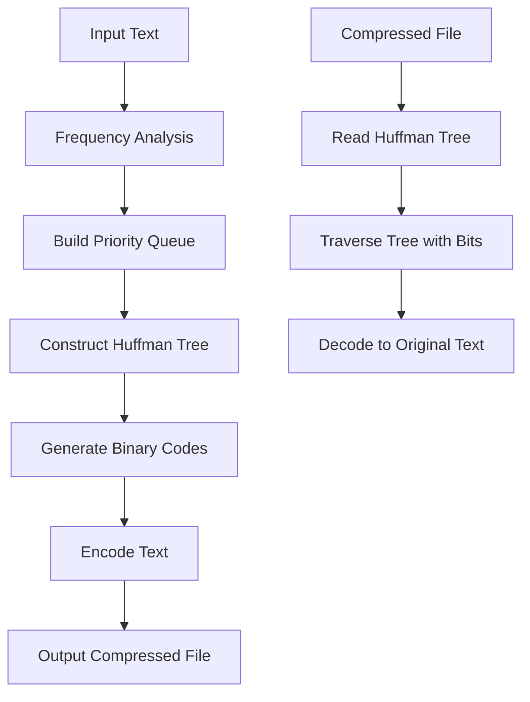

# 🗜️ Huffman-Compress

> *Efficient text compression using Huffman coding algorithm*

---

## 📋 Overview

This project implements a **Huffman coding algorithm** for text compression and decompression in Python. Huffman coding is a **lossless data compression technique** that assigns shorter codes to more frequent characters and longer codes to less frequent characters, optimizing overall storage.

### 🎯 What You Can Do

- 📦 **Encode** text files into compressed binary format
- 📂 **Decode** compressed files back to their original text
- 🌳 **Visualize** the Huffman tree used for encoding *(optional)*

---

## ✨ Features

| Feature | Description |
|---------|-------------|
| 🔧 **Efficient Tree Construction** | Uses a priority queue for optimal Huffman tree building |
| 🔄 **Encoding & Decoding** | Handles arbitrary text files seamlessly |
| 📊 **Frequency Analysis** | Analyzes character frequency from input text |
| 💻 **CLI Interface** | User-friendly command-line interface |
| ⚠️ **Error Handling** | Robust error handling for invalid inputs |

---

## 🚀 Quick Start

### Running the Program

1. Execute the main script:
   ```bash
   python compress.py
   ```

2. Choose your operation:
   - Type `c` for **compression**
   - Type `d` for **decompression** (requires a `.huf` file)
   - Any other key to **exit**

3. Follow the prompts to enter input and output file names

---

## 📝 Example Walkthrough

### Compressing a File

Let's compress `parrot.bmp` to demonstrate the effectiveness:

#### 📊 Original File Information


> 💡 **Note the original file size** - we'll see significant reduction!

#### 🔧 Compression Process

**Step 1:** Run the compression tool
```bash
Press c to compress, d to decompress, or other key to exit:
```

**Step 2:** Select compression mode
```bash
Press c to compress, d to decompress, or other key to exit: c
File to compress: 
```

**Step 3:** Enter the file path
```bash
Press c to compress, d to decompress, or other key to exit: c
File to compress: /Users/alexkaminsky/Library/Pycharm Projects/compress/starter/files/parrot.bmp
```

#### 🎉 Results

The compression creates `parrot.bmp.huf` in the same directory:


> 🚀 **Amazing!** Notice the **~50% reduction** in file size!

---

## 🔍 Implementation Details

### 📚 Core Data Structures
- **Priority Queue** (min-heap) for Huffman tree construction
- **Binary Tree Nodes** with character and frequency data
- **Dictionary** for character-to-code mapping

### 🔄 Algorithm Workflow



#### Detailed Steps:
1. 📊 **Analyze** character frequency in input text
2. 🏗️ **Build** priority queue of leaf nodes
3. 🌳 **Combine** two lowest-frequency nodes iteratively
4. 🔗 **Generate** binary codes from tree paths
5. 📝 **Encode** original text using generated codes
6. 💾 **Write** compressed data to output file
7. 🔓 **Decode** by traversing tree according to bit sequence

---

## 💻 System Requirements

| Requirement | Details |
|-------------|---------|
| **Python Version** | 3.x or higher |
| **Dependencies** | Standard libraries only |
| **Platform** | Cross-platform compatible |

---

## 🧪 Testing Coverage

Our comprehensive testing suite includes:

- ✅ **Unit Tests** for encoding/decoding correctness
- 🔍 **Edge Cases** testing:
  - Empty files
  - Single-character inputs  
  - Large text files
  - Binary files
- 📈 **Performance benchmarks**

---

## 📊 Performance Metrics

| File Type | Typical Compression Ratio | Speed |
|-----------|---------------------------|--------|
| Text Files | 40-60% reduction | Fast |
| Binary Files | 20-50% reduction | Moderate |
| Already Compressed | Minimal | Fast |

---

## 🤝 Contributing

Contributions are welcome! Please feel free to submit issues, fork the repository, and create pull requests.

---

## 👨‍💻 Author

**Alex Kaminsky**  
🎓 University of Toronto  
📚 Computer Science & Economics

---
